# Evidencias · RA2 SBD (rellenar por el alumnado)

> Completa este documento con capturas/salidas. No incluyas secretos.
> Indica si has usado **Variante A (IAM Role)** o **Variante B (aws configure)**.

## 0) Identificación
- Alumno/a: Diego
- Grupo: IABD
- Variante usada (A/B): B
- Región AWS: us-east-1
- Bucket S3: iabd03-Tarea-RA2

---

## 1) S3 privado
- [x] Captura del bucket (nombre y región)


- [x] Captura/confirmación de que **no es público** (Block Public Access o permisos)


- [x] Captura del objeto JSON en `data/sensores/`


**Notas:**
- Key usada (S3_KEY): `s3://iabd03-tarea-ra2/data/sensores/iabd03_sensores.json`

---

## 2) Notebook / Script de subida
- [x] Captura de la ejecución del notebook/script subiendo a S3
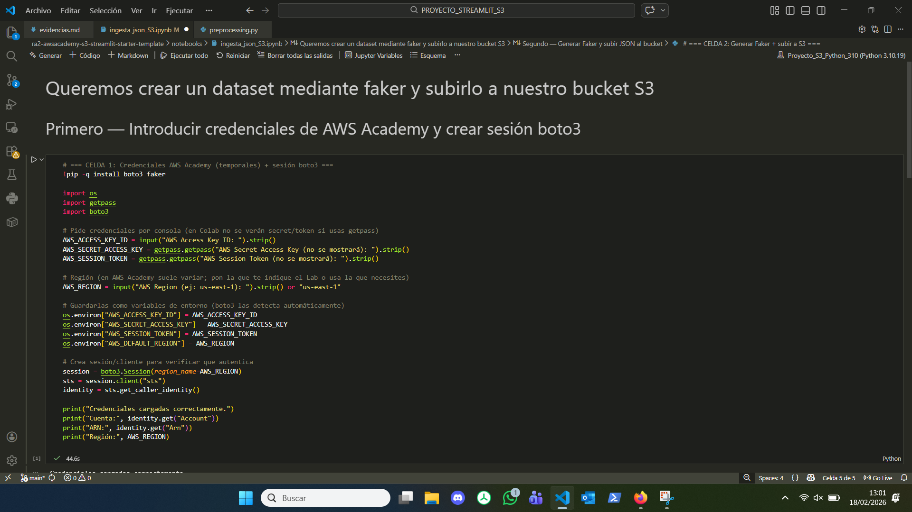
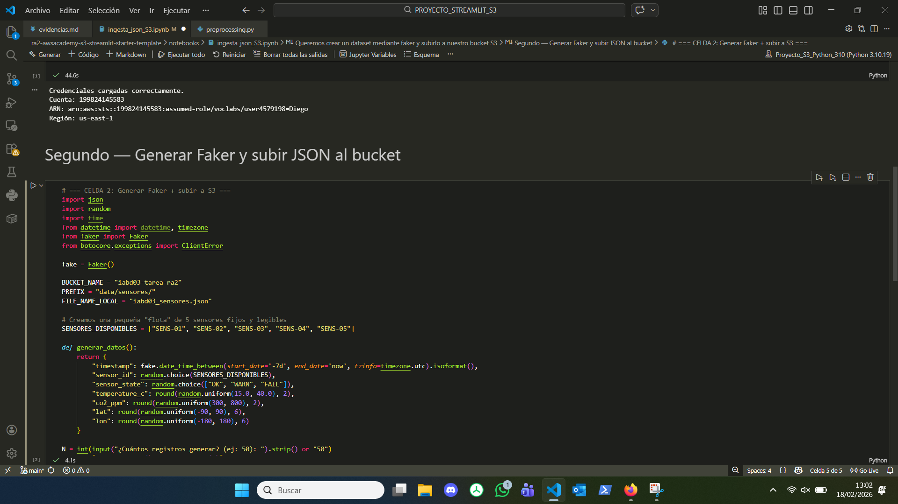
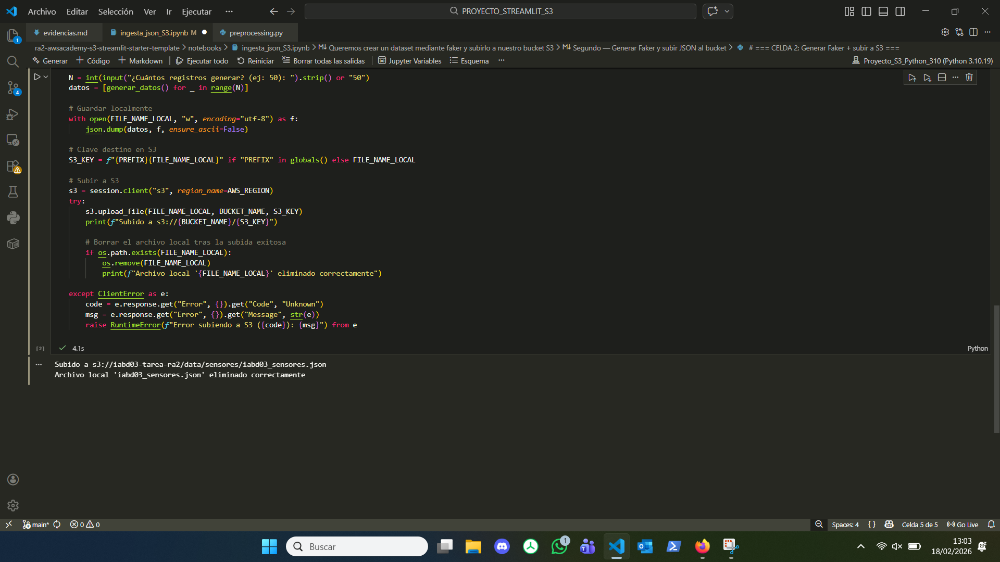


- [x] Enlace o ruta del archivo en el repo (`notebooks/...`): `notebooks/ingesta_json_S3.ipynb`

---

## 3) EC2 y red
- [x] Captura de la instancia EC2 (Ubuntu 22.04)


- [x] Captura del Security Group con puerto 8501 abierto (según reglas del lab)


- [x] Salida de `ssh` conectando (sin mostrar claves)


---

## 4) Acceso a S3 desde EC2 (sin secretos)
Ejecuta en EC2:

```bash
aws sts get-caller-identity
aws s3 ls s3://iabd03-tarea-ra2/data/sensores/
```

- [x] Captura/salida de ambos comandos


---

## 5) Streamlit en EC2
- [x] Captura de `streamlit hello` funcionando (o `python -c "import streamlit"`)


- [x] Captura de instalación de dependencias (`pip install -r requirements.txt`)


---

## 6) Dashboard (funcionalidad)
Incluye capturas donde se vea:

- [x] Filtro por `sensor_state`
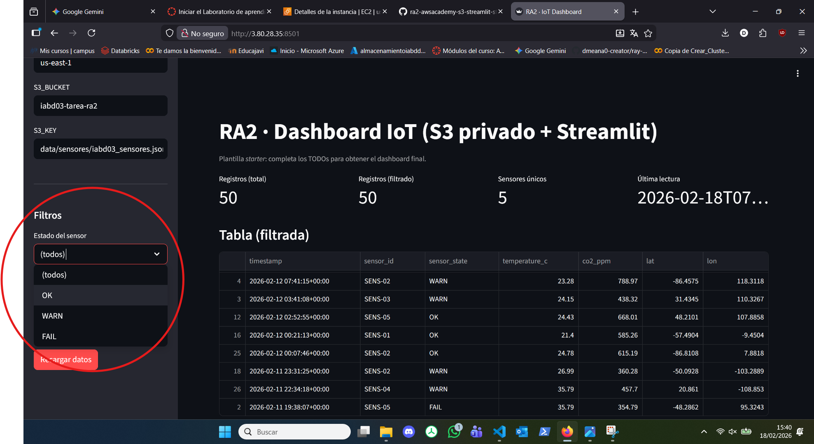
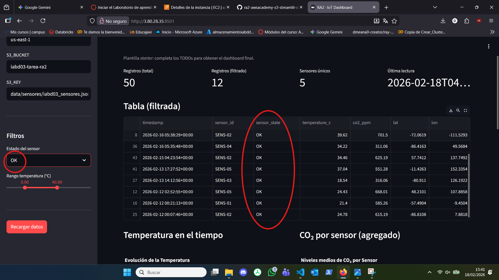

- [x] Slider de temperatura
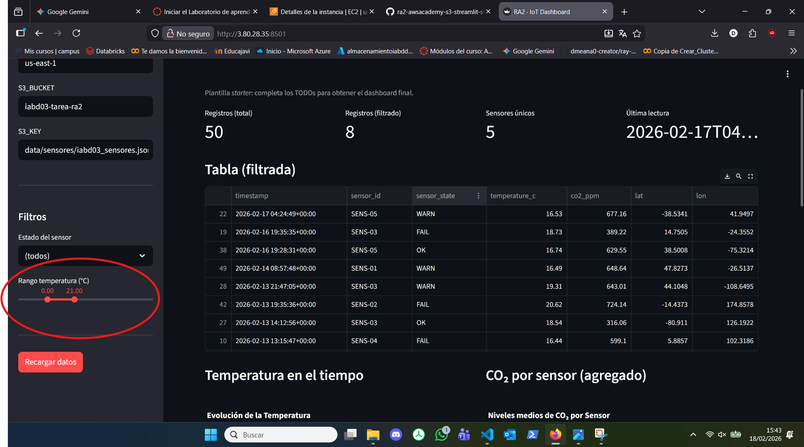

- [x] Tabla filtrada
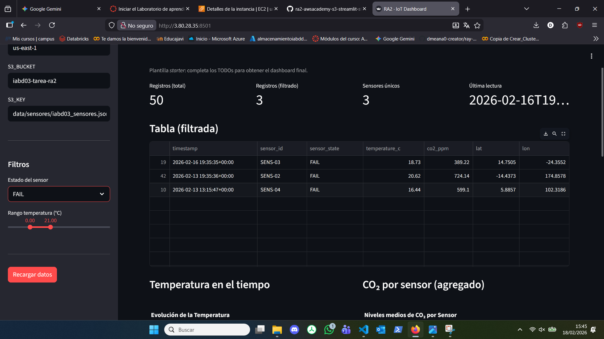

- [x] Gráfica línea (temperatura vs tiempo)
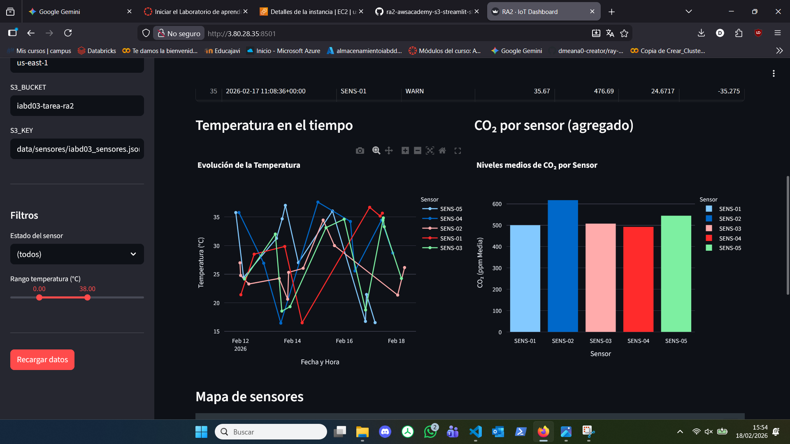
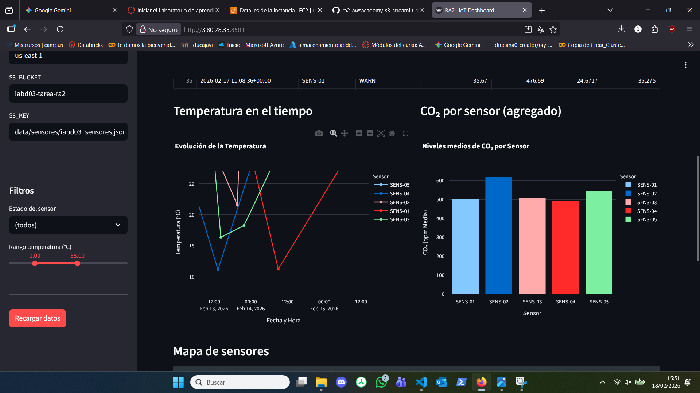

- [x] Gráfica barras (CO₂ por sensor)
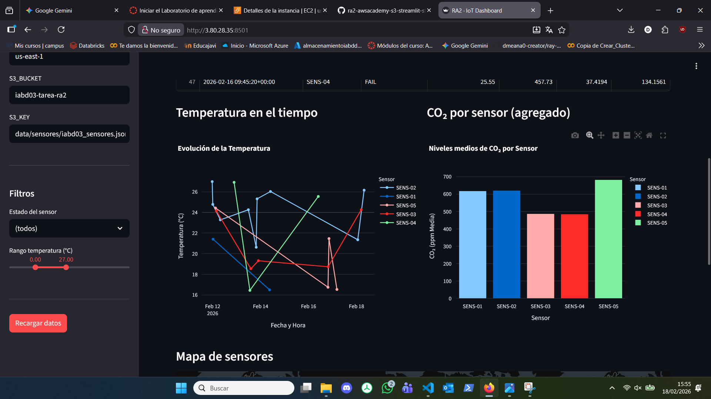

- [x] Mapa con sensores
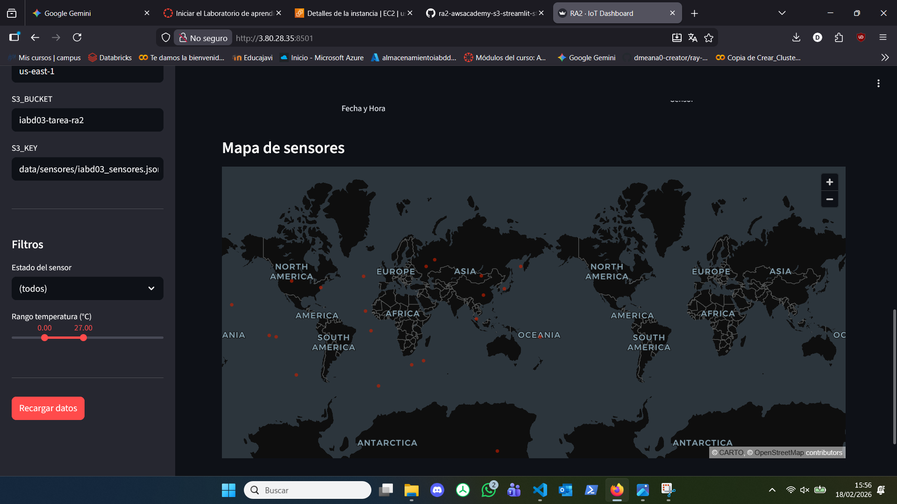

---

## 7) Despliegue final
- [x] Script usado para arrancar en segundo plano (ej. `nohup` o script):
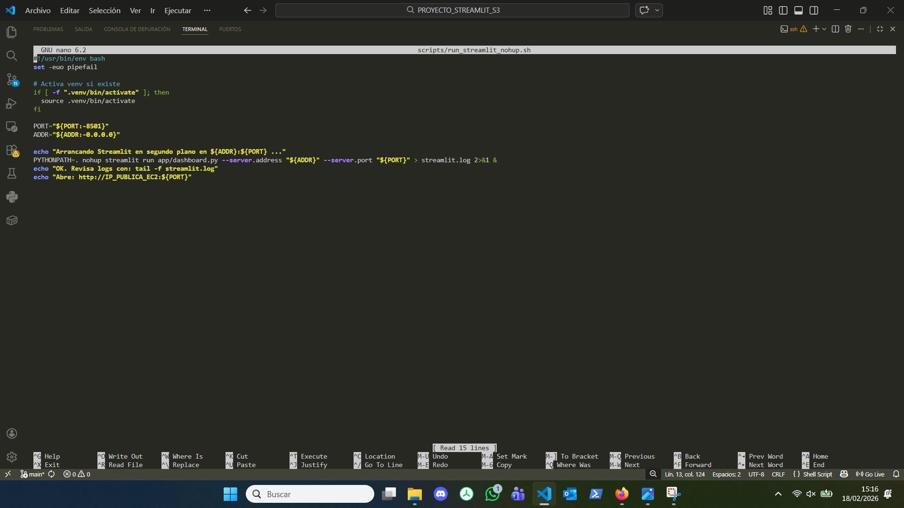

- [x] Captura del log (`tail -n 50 streamlit.log` o similar)
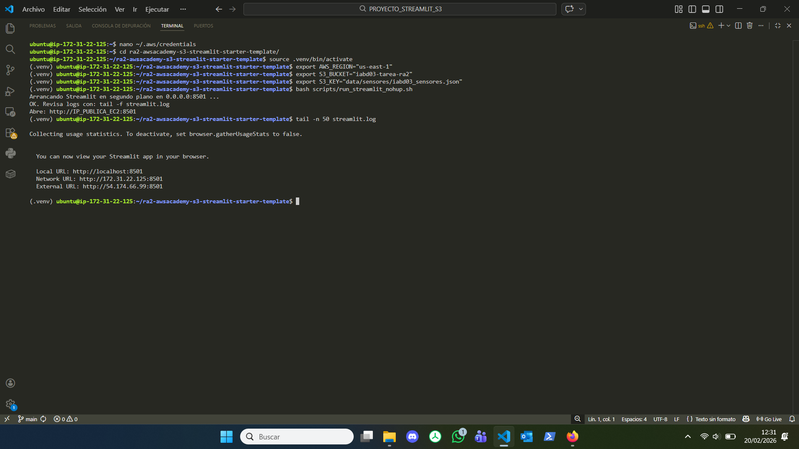

- [x] URL final: `http://IP_PUBLICA_EC2:8501`, en la captura que he hecho `http://3.80.28.35:8501/`

**URL:** `http://IP_PUBLICA_EC2:8501`

- [x] Captura en navegador accediendo a la URL
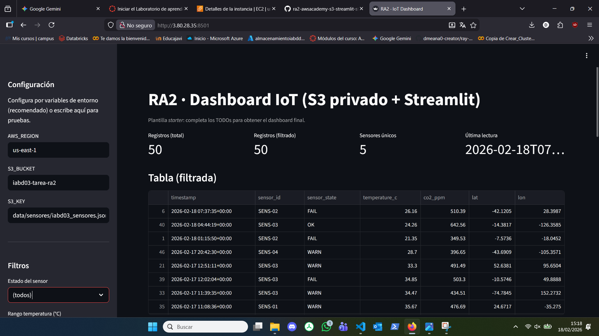

---

## 8) Observaciones (opcional)
- Problemas encontrados y solución:

### 1. Incidencia de conectividad SSH

Al intentar establecer la conexión SSH con la instancia EC2 mediante el comando `ssh -i labsuser.pem ubuntu@3.80.119.225`, me encontré con una incidencia de seguridad relacionada con los permisos del sistema operativo local que fue resuelta de la siguiente manera:

**Error de "UNPROTECTED PRIVATE KEY FILE!" (Permisos de la clave .pem)**

* **Problema:** El cliente SSH rechazó la conexión mostrando el error `Permission denied (publickey)` junto con la advertencia `Permissions for 'labsuser.pem' are too open`. Esto ocurre en entornos Windows porque, por defecto, el sistema operativo asigna permisos de lectura a múltiples usuarios (como el grupo Usuarios). El protocolo SSH exige estrictamente que el archivo de la clave privada solo sea accesible por el propietario; de lo contrario, lo ignora de inmediato para evitar que la credencial sea comprometida.

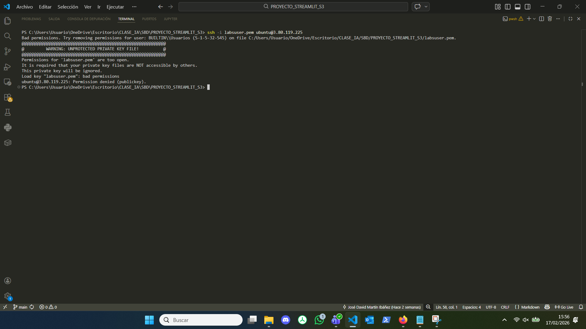

* **Solución:** Para cumplir con la política de seguridad estricta de SSH, se modificaron los permisos del archivo `labsuser.pem` utilizando la herramienta de línea de comandos `icacls` nativa de Windows (desde PowerShell):

  Primero, se eliminó la herencia de permisos del archivo para aislarlo:
  ```powershell
  icacls labsuser.pem /inheritance:r
  ```
  Segundo, se concedió permiso de solo lectura (R) única y exclusivamente al usuario actual de la máquina local:
  ```powershell
  icacls labsuser.pem /grant "Usuario:(R)"
  ```

  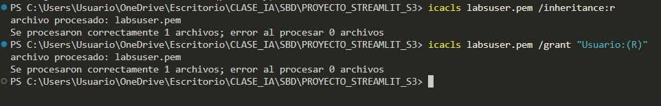

Tras aplicar esta corrección, la ejecución del comando `ssh -i labsuser.pem ubuntu@<IP_PUBLICA_EC2>` se realizó con éxito, permitiendo el acceso seguro a la terminal de Ubuntu de la instancia EC2.
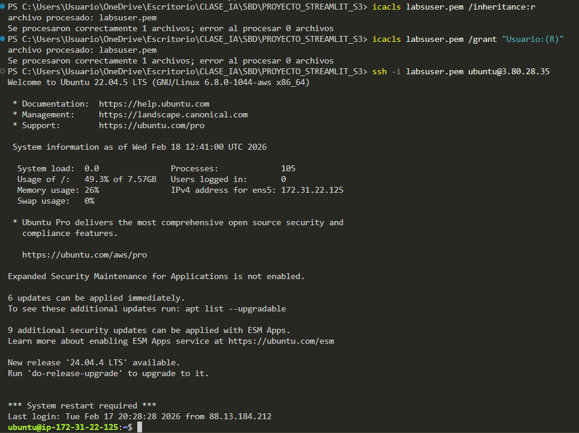

### 2. Incidencia Error de importación de módulos (ModuleNotFoundError)

**Error de "ModuleNotFoundError: No module named 'app'"**

* **Problema:** Durante la fase de despliegue del dashboard en la instancia EC2, al intentar ejecutar la aplicación con el comando estándar (`streamlit run app/dashboard.py`), se produjo un error de ejecución indicando que no se encontraba el módulo 'app'. Este error impedía el arranque de la aplicación web. La causa era que Python tomaba el subdirectorio `app/` como punto de referencia principal y no era capaz de resolver las importaciones absolutas que parten de la raíz del proyecto (como `from app.services.s3_loader import...`).

* **Solución:** Para solucionar esta incidencia de forma limpia y sin tener que modificar el código fuente de la aplicación, se procedió a inyectar la variable de entorno `PYTHONPATH=.` directamente en el comando de ejecución. Al anteponer esto, se le indica explícitamente al intérprete de Python que añada el directorio actual (`.` representa la raíz del proyecto) a su lista de directorios conocidos. De esta forma, reconoce correctamente la estructura completa del proyecto y resuelve todas las dependencias.
  
  El comando final modificado en el script de ejecución en segundo plano quedó de la siguiente manera:
  ```bash
  PYTHONPATH=. nohup streamlit run app/dashboard.py --server.address 0.0.0.0 --server.port 8501 > streamlit.log 2>&1 &
  ```


